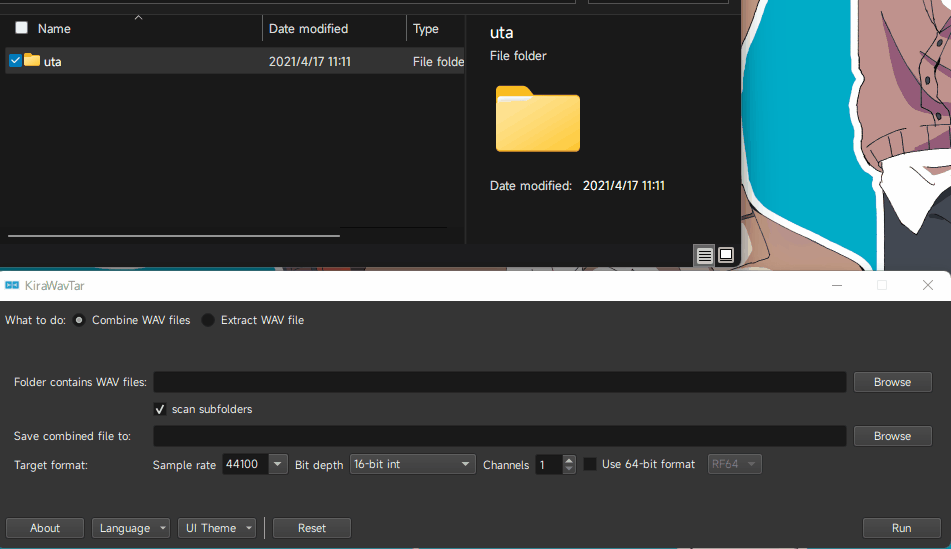

#  KiraWAVTar

Fast, easy-to-use WAV combine/split tool, providing another way to apply editing on a batch of WAV files.

## Usage

### When to use

Apply certain effects/auto-fixes on a batch of files can be a thing when post-processing audio files. For example, you have a batch of recordings that have similar problems (like the same background noise and mouth clicks), which for most circumstances can be fixed by passing through a great FX plugin. It can be a nightmare if you apply the same effects on individual files manually.

Using KiraWAVTar, these scattered audio files can be combined into a big file that can be edited all in one place.

#### But...Why not use batch processing?

Softwares like Adobe Audition and iZotope RX all have their own batch processing mechanism and yes, with these you can also reach the same goal above. But these solutions can be unintuitive to use, and all works like a black box, which means you can not stop at a specific step to get a result for determining what to do next. Depending on your workflow and need, editing a combined file may be a better solution.

### How to use

KiraWAVTar has an intuitive UI that doesn't need much guidance on how to use it.

The basic workflow here is get your wav files ready in a folder (in which can be organized with any folder structure you like), and use combine page to combine it. Edit it in the software you like, then extract it back into separated files using extract page.

By the way, you can drop folder/file into path input, like this:

KiraWAVTar will try to give you a result path for convenience when dropping a source path. You can change it to what you like afterwards.

### Why KiraWAVTar?

#### Speed

Thanks to [KFR audio library](https://kfrlib.com/) and coding with parallel execution in mind, KiraWAVTar is very fast.

For [example](https://www.bilibili.com/video/BV1pb4y1Y7Mw), on Intel i7-9750H and WD MyPassport 25E1, combing 2000 wav files that have 3 hours in total only takes about 48 seconds while extracting it back only takes about 34 seconds (It's a very **causal** test and your result can be vary).

#### Easy to use

- It provides an intuitive UI and kinda of drag-and-drop workflow
- It remember source folder structure, file name and file format when combining and construct it back when extracting
- It convert sample rate (a.k.a resample) automatically when needed

## Format support

KiraWAVTar supports these wav containers: RIFF, RF64, W64.

KiraWAVTar supports these sample type: 8-bit int, 16-bit int, 24-bit int, 32-bit int, 64-bit int, 32-bit single float (IEEE), 64-bit double float (IEEE).

## Supported platform

This repo doesn't contain any non-portable code, and its dependencies are all cross-platform too. It should have no problem to be compiled on major platforms.

Since I daily drive Windows x64, the pre-built binary is only available in this platform. It shall support Windows 7+ (as Qt 5.15 did).

## Translations

I can only provide English and Simplified Chinese translation on my own. Japanese translation by my friend is coming soon.

Since it's a standard Qt project written with i18n support, however, you can use Qt's i18n toolchain (lupdate, lrelease, Qt Linguist) to translate this program. You should translate [KiraCommonUtils](https://github.com/shine5402/KiraCommonUtils) and copy ``qtbase`` translation from Qt itself also. Consult ``translations`` in binary archive for an example.

## By the way...

### Where is this name come from?

It's come from [nwp8861's program "wavtar"](https://osdn.net/users/nwp8861/pf/wavTar/wiki/FrontPage). KiraWAVTar is basically my "Hey that's too hard to use, let's make a new one!" version of it. For the name itself, however, I think it's pretty straightforward, wav+[tar](https://man7.org/linux/man-pages/man1/tar.1.html)...

### Use it as utauwav

Utauwav is a tool for utau users to make wavs under their voicebank most suitable for utau resamplers' needs. Extracting as 44100Hz, 16-bit int, 1 channel, RIFF(non-64bit) WAV can give almost same behavior.

## Build

You need to build KFR audio library first, sicne it's a cmake project and can not just plug into qmake building trees.

KiraWAVTar don't use DFT part of KFR, so all supported compliers is ok.

Because of the lack of RF64 support in KFR currently, this project use [my own modified version of it](https://github.com/shine5402/kfr/tree/dev). So build this, and configure it in ``src/external-libs.pri``. ``src/external-libs_template.pri`` is there for help. 

Other dependencies are all ``git subtree`` in this repo, and all configured in ``.pro`` file. So you can just compile it in Qt Creator.

It's recommended to using Qt 5.15 since I use it while developing this. But Qt 6 shouldn't change that much to break code compatibility with this project.

## License

    This program is free software: you can redistribute it and/or modify
    it under the terms of the GNU General Public License as published by
    the Free Software Foundation, either version 3 of the License, or
    (at your option) any later version.
    This program is distributed in the hope that it will be useful,
    but WITHOUT ANY WARRANTY; without even the implied warranty of
    MERCHANTABILITY or FITNESS FOR A PARTICULAR PURPOSE.  See the
    GNU General Public License for more details.
    You should have received a copy of the GNU General Public License
    along with this program. If not, see https://www.gnu.org/licenses/.

## 3rd party libraries used by this project

<ul>
<li>Qt, The Qt Company Ltd, under LGPL v3.</li>
<li><a href="https://www.kfrlib.com/">KFR - Fast, modern C++ DSP framework</a>, under GNU GPL v2+, <a href="https://github.com/shine5402/kfr">using our own modified version</a></li>
<li><a href="https://github.com/shine5402/KiraCommonUtils">KiraCommmonUtils</a>, shine_5402, mainly under the Apache License, Version 2.0</li>
<li><a href="https://github.com/mapbox/eternal">eternal</a>, mapbox, under ISC License</li>
</ul>